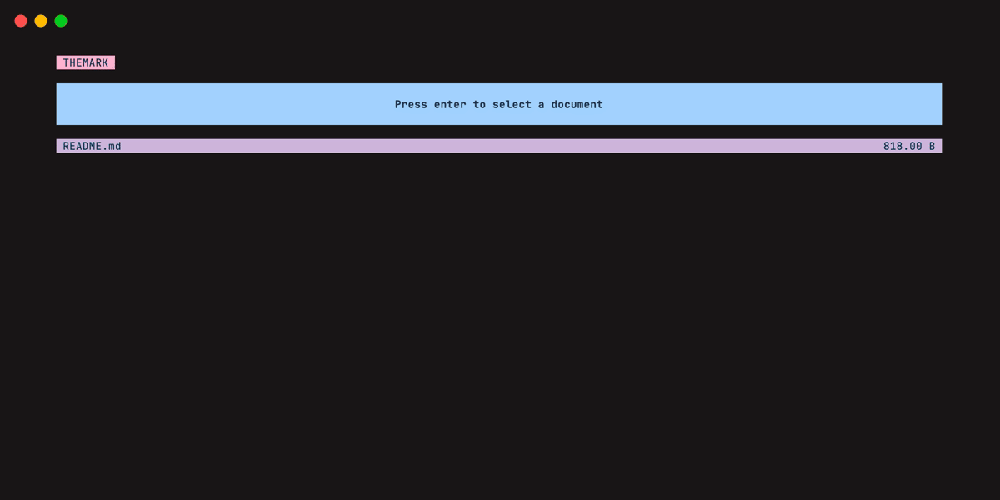

# Themark

Simple markdown viewer written in rust, powered by anathema. This project was made to try out anathema's
capabilities for TUIs, and is meant to use and showcase many of its features.



## How to use

You just need to use `cargo run -- <markdown_file_path>` or use the binary you can get from `cargo build`.
Themark features syntax highlighting for text blocks using syntect, and pretty markdown viewing.

Expamples:

```sh
cargo run -- README.md
cargo build --release && ./target/release/themark-cli README.md
```

### Keymaps

Using themark is really simple, use:

- J or ArrowDown to scroll down;
- K or ArrowUp to scroll up;
- PageUp to scroll half a page up;
- PageDown to scroll half a page down.
